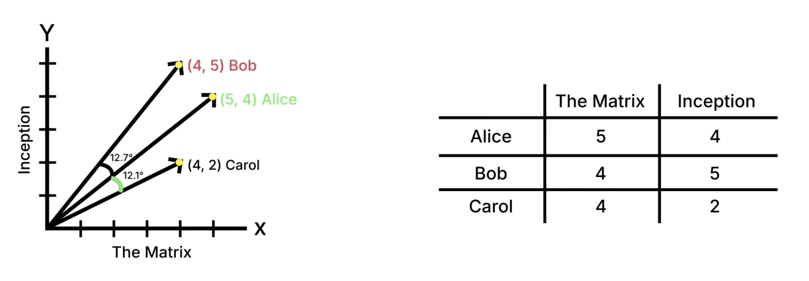

# Computing Similarities

## Cosine Similarity

Cosine similarity is a metric used to determine the cosine of the angle between two non-zero vectors in a multi-dimensional space.

It's a measure of **orientation and not magnitude**, ranging from -1 to 1.

In the context of text similarity, this metric provides a robust way to gauge the similarity between two sets of text data.

Simply put, it's a measure of how similar the ideas and concepts represented in two pieces of text are.

### A closer look at word embeddings

Word embeddings are essentially vectors that capture the semantic essence of words. Essentially, words that are semantically similar would be located near each other. In computational terms, this "location" is what a word embedding captures.

### The intuitive appeal of cosine similarity

Cosine Similarity measures the cosine of the angle between two vectors. If two vectors are pointing in the same direction, the angle between them is zero, and the cosine is 1. If they are orthogonal, meaning they share no ‘directionality,’ the cosine is zero.

In the context of word embeddings, think of each vector as an arrow pointing from the origin to the ‘location’ of a word in our imaginary library. Words that are semantically similar will have vectors pointing in similar directions, resulting in a higher Cosine Similarity:

(While this graph is not directly related, and actually somewhat indicates the importance of magnitude, the idea remains)

Cosine similarity normalizes vectors to focus **solely on direction**. Therefore, it does not include magnitude (unlike the dot product which includes both the magnitude and direction of the vectors).

### More Info

A short document and a long document about the same topic will produce embeddings of different magnitudes, but similar directions. In the instance where we're looking for **semantic similarity** (are these documents about the same thing?), it works well.

Disregarding magnitude help with interpreting general semantic similarity. However, disregarding magnitude also
